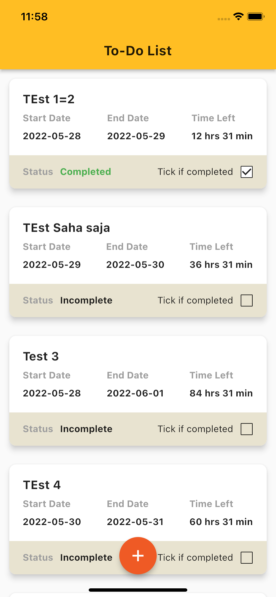
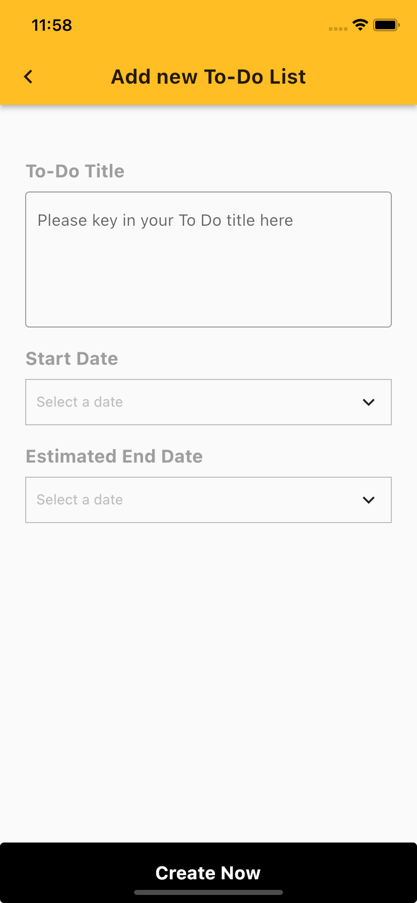
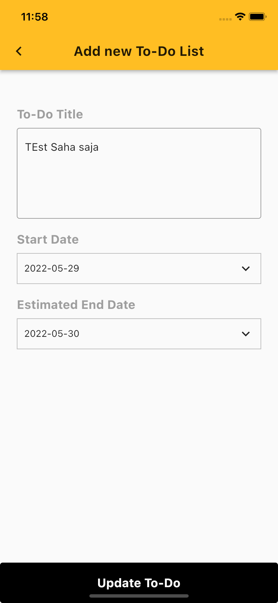
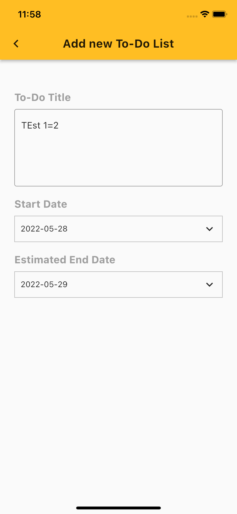

# inv2

To-Do List project

## To-Do List App

This project is a simple To-Do app.

What can be done inside this app?

- Add new To-Do record
- Edit existing To-Do record
- Keep track remaining time to complete the To-Do record.project
- Check the completed task for tracking purpose

#### Packages used for this project

- [get](https://pub.dev/packages/get)
- [sembast](https://pub.dev/packages/sembast)
- [path_provider](https://pub.dev/packages/path_provider)
